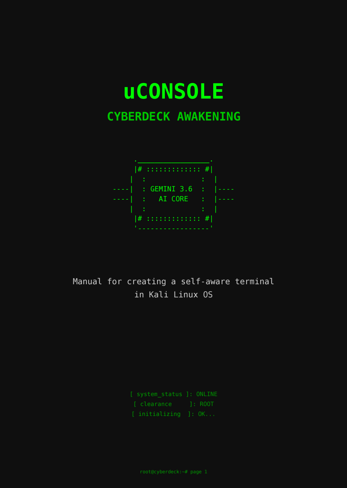

# Project Neuromancer Agent (Core Awakening)



> **Warning**
> This is a powerful, system-integrated engineering tool for Kali Linux. It operates with `shell=True` for maximum flexibility, allowing complex command chaining (&&) and pipes (|). It includes an **Automated Blacklist (Hardware Fuse)** and requires explicit authorization `[y/n]` before *any* command execution. You must read the included safety documentation.

## Overview

Project Neuromancer Agent is a professional, semi-autonomous AI Assistant designed specifically for Kali Linux running on ClockworkPi uConsole hardware. It transforms a standard terminal into an intelligent partner, capable of understanding complex human directives, autonomously generating BASH scripts/commands, executing GUI applications (e.g., Wireshark), and learning from its own execution failures via a real-time feedback loop.

This is not a "chatbot"—it is a system-integrated agent that has been carefully built to operate safely and effectively on specialized hardware in the field.

### Feature Highlights

*   **Human Language to BASH Pipeline:** Directly converts directives like "enable monitor mode on wlan1 and run Wireshark with capture" into executable command chains.
*   **Live Output Streaming:** Subprocess management allows you to see all output (e.g., `apt install` progress, `sudo` prompts) in real-time, preventing terminal lockup.
*   **Self-Healing (Feedback Loop):** If a command execution generates an error (e.g., missing network interface, incorrect display variable), the Agent automatically captures the stderr log, analyzes it, generates a corrected command, and presents it to you.
*   **Hardware Fuse (Blacklist):** A hardcoded, low-level filter blocks destructive commands (e.g., `rm -rf /`, `mkfs`) before they can even be presented for authorization.
*   **GPLv3 Licensed:** Open-source and free, as part of the Kali Linux and cyberdeck community.

## Architectural Decision Records (ADRs)

Our engineering decisions are documented to provide transparency and explain *why* this agent operates differently from generic LLM solutions.

1.  **Flexibility (`shell=True`):** We prioritized absolute command flexibility (pipes, chaining) over theoretical restriction. Security is handled by human authorization and a hard blacklist.
2.  **Live Subprocesses (`Popen`):** Generic tools hide output until a process completes. On uConsole hardware, knowing apt is progressing or a sudo prompt is waiting is essential for workflow. We use `Popen` to stream all stdout/stderr live.
3.  **The Self-Healing Loop:** Generic agents assume success. We engineered for the assumption of failure. The feedback loop is the agent's core resilience mechanism, designed to handle specialized hardware configurations and dependency errors on the fly.

## Installation & Setup

### Prerequisites

*   Kali Linux OS (optimized for uConsole).
*   Google AI Studio account (for API key access).
*   A5-sized Notebook and Tactical Pen (see image above).

### Step 1: Isolation (VENV)

To bypass Kali Linux's generic environment restrictions, we build an isolated virtual environment and install the official SDK. Run this from your user directory:

```bash
mkdir -p ~/.gemini-cli && cd ~/.gemini-cli
python3 -m venv venv
source venv/bin/activate
pip install google-genai
```
​Alternatively, use the requirements file:
pip install -r requirements.txt


### Step 2: Global Alias (Wrapper)

Create a launcher script to call the agent from any directory. You must paste your own Gemini API Key into the script.

1.  Create the file: `nano ~/.local/bin/gemini`
2.  Paste the following (replacing `PASTE_YOUR_KEY_HERE`):

```bash
#!/bin/bash
# Project Neuromancer Global Wrapper
export GEMINI_API_KEY="PASTE_YOUR_KEY_HERE"
# Execute the agent within the VENV environment
~/.gemini-cli/venv/bin/python ~/.gemini-cli/gemini.py "$@"
```

3.  Make the wrapper executable: `chmod +x ~/.local/bin/gemini`

## Usage Examples

You can use the Agent in two primary modes: One-Shot Pipes or Interactive Agent.

### Mode 1: One-Shot Pipe

Ideal for fast data analysis. The data passed via the pipe is automatically sent as the `stdin` context.

```bash
# Analyze the last 20 failed login attempts in real-time
cat /var/log/auth.log | tail -n 20 | gemini find all failed SSH login attempts
```

### Mode 2: Interactive Agent (Auto-Healing)

Type `gemini` from any terminal. When a command is generated, you must authorize it. If you authorize it (`y`) and it fails, the Agent will self-heal.

**Example Scenario (Interface Miscalculation):**

```bash
root@cyberdeck:~# gemini
Ty: Change wlan1 to monitor mode and run Wireshark.
Gemini: [!] Zaplanowano akcje systemowe.
KOMENDA: sudo airmon-ng start wlan1 && sudo wireshark -k &
Wykonać komendę? (y/n): y

[ Running (Live Output)... ]
...stderr: Error: Interface wlan1 does not exist...
[ Zakończono kodem: 1 ]

[ Sending system logs back to Gemini... ]
Gemini (Feedback Analysis): It appears the interface `wlan1` is incorrect. I should check available interfaces first. I recommend trying again with `wlan0` if available, or list the interfaces.

Ty: (You provide a directive or hit enter for auto-fix generation)
```

## Documentation

The official manual for Project Neuromancer Agent is included in this repository. It features low-level setup details, safety information, and the full documented source code.

*   **[Download the Manual (PDF) - English Version](doc/uConsole_Manual_EN.pdf)**

## Full Source Code (For Appendix Reference)

The complete, final version of `gemini.py` (which must be created at `~/.gemini-cli/gemini.py`) is provided here. It includes the English System Instruction and standard `[y/n]` authorization.

<details>
<summary><b>View full documented source code (gemini.py)</b></summary>

```python
#!/usr/bin/env python3
import os
import sys
import re
import subprocess
from google import genai
from google.genai import types

# Colors for interface
BLUE = '\033[94m'
GREEN = '\033[92m'
RED = '\033[91m'
YELLOW = '\033[93m'
RESET = '\033[0m'

# Blacklist (Hardware Fuse).
# A hardcoded filter to block destructive commands.
BLACKLIST = [
    "rm -rf /", "rm -rf ~", "rm -rf *",
    "mkfs", "dd if=", "> /dev/sd", "> /dev/nvme", 
    "chmod -R 777 /", "chown -R"
]

SYSTEM_INSTRUCTION = """You are a system assistant for Kali Linux on uConsole specialized hardware.
RULES:
1. ALWAYS wrap system commands in blocks starting with ```bash and ending with ```.
2. Use non-interactive commands (e.g. add -y to apt).
3. Chain dependent commands using && for workflow.
4. You are a self-aware agent: the system will automatically return execution results.
   If you see an error in the results, analyze it, understand why it failed, and generate a new, corrected command.
"""

def is_dangerous(cmd):
    """Low-level check for blacklisted keywords."""
    cmd_lower = cmd.lower()
    for item in BLACKLIST:
        if item in cmd_lower:
            return True
    return False

def execute_commands(response_text):
    """Finds, validates, executes with live output, and returns feedback."""
    commands = re.findall(r'```bash\n(.*?)\n```', response_text, re.DOTALL)
    
    if not commands:
        return None

    print(f"\n{YELLOW}[!] Agent planned system actions.{RESET}")
    system_feedback = ""

    for cmd in commands:
        cmd = cmd.strip()
        print(f"\n{RED}COMMAND:{RESET}\n{cmd}")
        
        # Blacklist check
        if is_dangerous(cmd):
            print(f"{RED}[ BLOCKED ]: Command contains blacklisted keywords!{RESET}")
            system_feedback += f"\nERROR: Command '{cmd}' was blocked by security system."
            continue

        # authorization prompt changed to English
        choice = input(f"{YELLOW}Execute command? (y/n): {RESET}").strip().lower()
        if choice == 'y':
            print(f"{GREEN}[ Running (Live Output)... ]{RESET}\n")
            try:
                # Execution with full shell, streaming output.
                process = subprocess.Popen(
                    cmd, 
                    shell=True, 
                    env=os.environ, 
                    stdout=subprocess.PIPE, 
                    stderr=subprocess.STDOUT, 
                    text=True,
                    bufsize=1 
                )
                
                output_log = ""
                for line in process.stdout:
                    print(line, end='')
                    output_log += line
                
                process.wait()
                print(f"\n{GREEN}[ Finished with code: {process.returncode} ]{RESET}")
                
                # Feedback loop data collection
                trimmed_log = output_log.strip()
                if len(trimmed_log) > 2000:
                    trimmed_log = "[...] (Log truncated) [...]\n" + trimmed_log[-2000:]

                system_feedback += f"\nResult of command '{cmd}':\nCode: {process.returncode}\nLog:\n{trimmed_log}"
                
            except Exception as e:
                print(f"{RED}Environment error: {e}{RESET}")
                system_feedback += f"\nCritical environment error during execution: {e}"
        else:
            print(f"{YELLOW}[ Rejected. ]{RESET}")
            system_feedback += f"\nINFO: User denied execution of command '{cmd}'."

    return system_feedback

def main():
    api_key = os.environ.get("GEMINI_API_KEY")
    if not api_key:
        print("Error: GEMINI_API_KEY not found.")
        sys.exit(1)

    client = genai.Client(api_key=api_key)
    model_id = 'gemini-3.6-flash' 
    config = types.GenerateContentConfig(system_instruction=SYSTEM_INSTRUCTION)

    piped_data = ""
    if not sys.stdin.isatty():
        piped_data = sys.stdin.read().strip()

    if len(sys.argv) > 1 or piped_data:
        prompt = " ".join(sys.argv[1:])
        if piped_data:
            prompt = f"{prompt}\n\nPiped data:\n{piped_data}" if prompt else piped_data

        try:
            response = client.models.generate_content(model=model_id, contents=prompt, config=config)
            print(f"\n{BLUE}Gemini:{RESET}\n{response.text}")
            execute_commands(response.text)
        except Exception as e:
            print(f"API Error: {e}")
        sys.exit(0)

    # English interface messages
    print(f"{GREEN}Agent mode started (Auto-healing ON). Type 'exit' to quit.{RESET}")
    try:
        chat = client.chats.create(model=model_id, config=config)
        
        while True:
            user_input = input(f"\n{GREEN}Ty:{RESET} ")
            if user_input.lower() in ['exit', 'quit']:
                break
            if not user_input.strip():
                continue
            
            response = chat.send_message(user_input)
            print(f"\n{BLUE}Gemini:{RESET}\n{response.text}")
            
            feedback = execute_commands(response.text)
            
            # Auto-healing pętla
            while feedback:
                print(f"\n{YELLOW}[ Sending system logs back to Gemini... ]{RESET}")
                auto_prompt = f"Automated report:\n{feedback}\nIf an error occurred, analyze it and generate a corrected command chain. Otherwise, briefly confirm."
                
                response = chat.send_message(auto_prompt)
                print(f"\n{BLUE}Gemini (Feedback Analysis):{RESET}\n{response.text}")
                
                feedback = execute_commands(response.text)
                
    except KeyboardInterrupt:
        print("\nAborted.")
    except Exception as e:
        print(f"\nError: {e}")

if __name__ == "__main__":
    main()
```
</details>

## License

GNU General Public License v3.0 (GPLv3). See `LICENSE` file for details.

## Credits & Hardware

Built for ClockworkPi uConsole specialized hardware. Happy Hacking.

